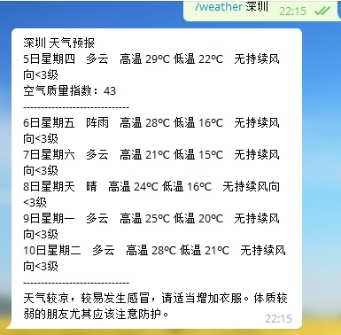

ExpressBot [](https://travis-ci.org/BennyThink/ExpressBot)
==


帮你查快递、自动追踪快递最新状态的Telegram机器人！成品可戳：

[@bennyblog_bot](https://t.me/bennyblog_bot)（此机器人由俺长期维护，但是**不提供任何保证**）

这个机器人不只是能聊天、查快递哦！信不信发语音给它也可以！还能搜美剧日剧！详细信息可以看功能和TODO


# 关于 #
由于最近机器人使用量突然飙升，使用轮询模式很容易导致快递100的免费API使用量超过2000次/天而导致被封IP，所以目前打算更换API。
暂时只发现了这么一个比较好的选择：
* 快递鸟：支持物流更新推送，只要这边写好就可以了；缺点是需要实名认证，又要多一个配置项。

欢迎各位有能力的人提交PR或者其他快递API的建议！感激不尽
**现在顺丰的查询依旧存在问题，不知道哪个API能够用**


## 功能 ##
* 查快递
* 列出历史查询
* 聊天（包含语音、文字）
* 群组聊天（使用/开头、回复机器人消息来呼叫机器人）：由于开启了隐私模式，所以只好这样啦~
* 美剧/日剧/电影查询
* 广播
命令列表：

> start - 输入快递单号来查询 
>
> help - 帮助
>
> list - 查看我的查询历史记录
>
> delete - 删除某个单号查询记录
>
> quickdel - 回复某条查询消息来快速删除单号查询记录
>
> query - 查询美剧、电影
>
> yyets - 查询下载链接
>
> weather - 查询指定城市近期天气预报


## 截图 ##





## 使用方法1：查快递 ##
添加机器人，直接发送运单编号即可查询（并添加到追踪中）；
如果你的单号带有字母，请使用`/start danhao123`；
如果你需要一次性追踪多个单号，请`/start 123,123`，使用英文半角逗号分隔（当然了，更新了就惨了)


## 使用方法2：闲聊 ##
直接发送消息即可，也可以发送语音（中文普通话）


## 使用方法3：查美剧 ##
* 查询美剧/日剧/电影：`/query 蝙蝠侠`
* 获得下载链接：`/yyets 神盾局`，之后点击按钮操作


## 部署环境 ##
需要部署在可以访问Telegram API的服务器上（或者设置代理），同时支持Python 2和Python 3，推荐用Python 3
已经在以下平台测试通过：

Windows 10： Python 2.7.13 32bit  Python 3.6.3 32bit

Ubuntu 16.04/14.04、CentOS 7、Debian 9： Python 2.7


## 部署方法1.自动脚本 ##

一键脚本在systemd的情况下运行会更好，一键脚本仅测试于Ubuntu 16.04：
先切换到root用户：
```bash
wget -N --no-check-certificate https://raw.githubusercontent.com/BennyThink/ExpressBot/master/install.sh && bash install.sh
```
然后按照提示操作。支持systemd的系统会同时安装为systemd服务，其他系统可以使用对应的init手动配置或使用`supervisor`
快捷操作
```bash
# 启动服务 
bash install.sh start
# 停止服务 
bash install.sh stop
```
注：CentOS下如果提示`wget: command not found`请先安装wget `yum install wget`


## 部署方法2.手动配置 ##
如果一键脚本失败，可以试试手动配置
### (1). 克隆代码 ###
```bash
git clone https://github.com/BennyThink/ExpressBot
cd ExpressBot
```
### (2). 准备环境 ###
#### Arch Linux  ####
```bash
pacman -S python python-pip python-certifi python-chardet python-future python-idna python-requests python-six python-urllib3
```
    然后从 AUR 安装  python-pytelegrambotapi .

#### 其他发行版、macOS ####
Python3 请使用`pip3`替换`pip`
```bash
pip install setuptools
pip install -r requirements.txt
```
#### Windows  ####
从[Python官网](https://www.python.org/)下载并安装Python，切换到项目目录，如果是 Python 2:
```cmd
pip install -r requirements.txt
```
如果是 Python 3，执行如下命令：
```cmd
pip3 install -r requirements.txt
```
### (3). 准备ffmpeg ##
ffmpeg是为了支持音频识别（使用ffmpe进行音频文件的转码）。

如果你是Windows，从[这里](https://ffmpeg.org/)下载ffmpeg的二进制exe文件（一共三个都需要），放到PATH中；
如果你是Linux发行版，直接用包管理器安装就可以（编译或者下载二进制也行），Debian系可以使用`sudo apt install ffmpeg`，RHEL可以使用`yum install ffmpeg`

### (4). 配置 ###
修改`config.py`进行配置，TOKEN为Bot的API，TURING_KEY若不配置则不启用机器人功能

```python
TOKEN = 'Your TOKEN'
TURING_KEY = 'Your Key'
```

创建单元文件：`vim /lib/systemd/system/expressbot.service`	
自行替换输入如下信息	
```
[Unit]	
Description=A Telegram Bot for querying expresses	
After=network.target network-online.target nss-lookup.target	

[Service]	
Restart=on-failure	
Type=simple	
ExecStart=/usr/bin/python /home/ExpressBot/expressbot/main.py	

[Install]	
WantedBy=multi-user.target
```
重新载入daemon、自启、启动
```bash
systemctl daemon-reload
systemctl enable expressbot.service
systemctl start expressbot.service
```
我使用了`restart=on-failure`参数，失败退出会重启。如果设置成always就意味着无论因为什么原因，只要进程不在了，systemd就会立刻帮我们重启。详情可以参见`systemd.service`手册。

### (5). 运行 ###
测试目的的话，以nohub或screen运行`main.py`，Python 3请用`python3`替换为`python`
```bash
cd /home/ExpressBot/expressbot
nohup python main.py
# 或者
cd /ExpressBot/expressbot
screen -S tgbot
python main.py
```

### (6). 计划任务 ###
如果需要追踪更新并推送，那么咱需要定期轮询。

目前使用的定时器是apscheduler，`config.py`中的interval可以来设置间隔时间

###  (7). 检查运行状态 ###
* systemd
控制命令：
```bash
# 查看运行状态
sudo systemctl status expressbot.service
# 启动
sudo systemctl start expressbot.service
# 停止
sudo systemctl stop expressbot.service
# 重启
sudo systemctl restart expressbot.service

```

* 其他系统
可以考虑使用对应系统的init，或者使用`supervisor`


## 隐私 ##
首先，请允许我大力的打击你，所有发往此机器人的消息都可能被记录下来。
但是实际上，此机器人比较良心，**默认**只会在数据库中记录查询成功之后的以下信息，使用`/list`命令可以看到：
* message_id 每条消息的id，用于任务计划跟踪物流发送回复
* chat_id 也是用户ID，用于标记回复给谁
* type 快递公司名称
* track_id 运单编号
* content 最新的物流信息
* timesstamp 最新物流更新时间

**如果你发送了语音，那么语音文件会被放到`/tmp`目录下**
我不保证我能够有节操不去查看数据库，但是我保证我会妥善保护数据库、不外泄。

所以，你要是不想用，就不用吧；或者，查完就删掉也是可以的。


## 另类用法1：消息记录机器人 ##
有一个文件叫`msg.py`，如果为了debug等需求，可以在`config.py`中把`LOGGER`设置成True
当然了，群组中你就不能设置图灵API了（甚至应该将查询快递的功能也废掉免得机器人乱说话）。
另外，群组中需要开启机器人的隐私模式。


## FAQ ##
### 服务器错误 ###
唔，可能是快递100的接口炸了吧；稍后重试。
### 查询不到结果 ###
可能是刚刚生成单号，快递100还没有数据
### 顺丰 ###
目前暂时没有找到可靠的REST API的顺丰快递查询接口。
### 查询失败 ###
目前正打算更换快递api，看样子好像快递鸟是个比较好的选择（支持推送），但是需要实名认证……
### query和yyets的区别 ###
`yyets`用于通过点击InlineKeyboardButton获取到正确的下载链接，但是前提要求是只能有一个检索结果（多个结果只返回第一个）；`query`则是用于检索全部信息。
比如说我想下载诺兰的黑暗骑士崛起，我就可以通过`query`找到唯一的名字，然后使用`/yyets 《蝙蝠侠：黑暗骑士崛起》(The Dark Knight Rises)`获取到唯一的结果。


## 致谢 ##
* [coderfox/Kuaidi100API](https://github.com/coderfox/Kuaidi100API) 快递100的原生API
* [jaehee~임재희](https://twitter.com/GFW) 感谢你的大力调戏
* [ヨイツの賢狼ホロ](https://github.com/KenOokamiHoro) 感谢你的commits，我直接无耻的拉过来了。
* [johnpoint](https://github.com/johnpoint) 一键安装脚本的大部分编写工作
* [speech_recognition](https://github.com/Uberi/speech_recognition) 提供多种语音识别的封装
* [pydub](https://github.com/jiaaro/pydub) 提供ffmpeg的封装
* [ffmpeg](https://ffmpeg.org/) 用于音频文件转码
* [人人影视字幕组](http://www.zimuzu.tv/) 提供海量影视资源及API


## TODO ##
按完成状态、优先级排列
- [x] 这个机器人可以跟你聊天扯淡呢~
- [x] Python 3 支持
- [x] Bug 修复：不显示最新
- [x] 一键脚本支持环境变量安装模式：在安装时选择环境变量模式还是配置模式，仅支持systemd
- [x] 单消息多单号处理：`/start 123,123` 英文半角逗号
- [x] 语音识别
- [x] 使用requests，抛弃pycurl
- [x] 搜索电影（目前准备使用人人影视的接口）
- [x] SSL 证书问题：目前暂时禁用了`InsecureRequestWarning`
- [x] 给全体用户发送广播：管理员专用
- [x] 改用apscheduler
- [x] TravisCI 测试用例
- [ ] Docker
- [ ] 人人影视 Access Key
- [ ] 添加其他聊天机器人支持[ref](https://github.com/evolsnow/robot)
- [ ] 更换快递api，放弃轮询模式


## License ##
GPL v2
